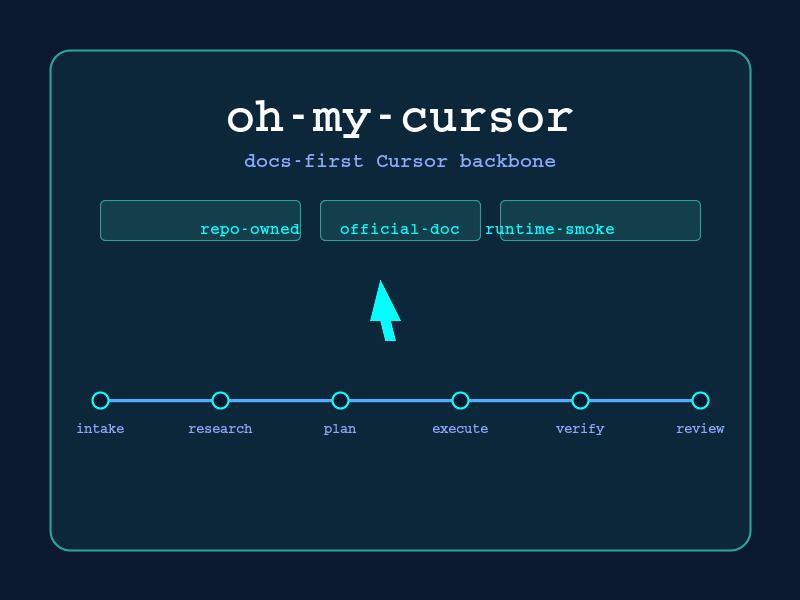

<!-- source-sha256: README.md dd7dc80f8e48c6f139c076931f66eea648a15c46e3c04869b7f557768a9c9911 -->
# oh-my-cursor

<div align="center">
  
</div>

一个 Cursor 原生的工作流主干骨架，为 Cursor 工作区提供规则（rules）、技能（skills）、智能体（agents）和生命周期钩子（hooks）。该插件编排了明确的生命周期—— intake (摄入)、research (调研)、plan (规划)、execute (执行)、verify (验证)、review (审查) —— 并将每一个功能声明都锚定到检入（checked-in）的产物中。

## 快速入门

只有一个编排根（orchestration root）：`phase-controller` 状态机。它针对单一的 workflow-state 契约（`.cursor/state/workflow-state.json`）启动或恢复任何非平凡任务。

若需无人值守运行，请在 Cursor composer 中输入 `@auto-execute`。它是该根之上的自主**预设（preset）**：它将 `phase-controller` 状态机驱动至完成，并沿着推荐路径串联其余默认技能—— `@deep-interview`（仅在请求模糊时）、`@plan`、`@iterate-loop` 和 `@verify` ——使首次运行得到一个可工作、有证据支撑的更改。当你希望手动控制每一次阶段转换（或在重启后恢复）时，可直接通过 `phase-controller` 进入。

### 安装

该插件根目录位于 `.cursor-plugin/plugin.json`，并安装到 `~/.cursor/plugins/local/oh-my-cursor/`。

```bash
# 从仓库根目录安装（复制模式 — 最小运行载荷）
node --experimental-strip-types scripts/install-local-plugin.ts

# 或者是包含可选的 MCP 桥接器以用于智能体调用状态写入
node --experimental-strip-types scripts/install-local-plugin.ts --with-mcp

# 软链接模式以用于实时开发（重载窗口后更改可见）
node --experimental-strip-types scripts/install-local-plugin.ts --symlink
```

安装完成后，在 Cursor 中执行重新加载 (**Developer: Reload Window**)。

使用以下命令验证安装： `node --experimental-strip-types scripts/check-local-plugin-install.ts`。

如需可复制粘贴的 workflow-state 演练，请参见 [`docs/recipes/workflow-state-lifecycle.md`](../recipes/workflow-state-lifecycle.md)。

## 包含组件

| 组件 | 位置 | 用途 |
|-----------|----------|---------|
| **Hooks 钩子** (14 个事件) | `hooks/hooks.json` + `hooks/` | 编排了每一个官方的 Cursor 钩子事件: `sessionStart`, `sessionEnd`, `beforeSubmitPrompt`, `preToolUse`, `postToolUse`, `postToolUseFailure`, `subagentStart`, `subagentStop`, `beforeShellExecution`, `afterShellExecution`, `beforeReadFile`, `afterFileEdit`, `preCompact`, 和 `stop`。所有脚本仅限标准库（stdlib-only）、fail-open（失败放行），且对工作流状态为只读 |
| **Agents 智能体** (14 个角色) | `agents/` | 完整的智能体角色注册表 — `orchestrator`, `architect`, `researcher`, `planner`, `implementer`, `qa-tester`, `verifier`, `critic`, `code-reviewer`, `debugger`, `tracer`, `security-reviewer`, `explore`, `test-engineer`。所有检入智能体均默认使用 `model: auto`，除非基准测试结果证明必须锁定特定模型 |
| **Skills 技能** (20 个技能) | `skills/` | 编排: `phase-controller`, `plan`, `iterate-loop`, `auto-execute`, `review`, `security-review`, `debug`, `trace`, `verify`, `deep-interview`, `doctor`, `local-plugin-check`, `mcp-setup`, `parallel-batch`, `team-controller`。记忆层: `remember`, `notepad`, `wiki`, `decisions`, `rules-authoring` |
| **Rules 规则** | `.cursor/rules/` + `rules/` | Cursor 工作区指南以及插件边界兼容性策略 |
| **Memory templates 记忆模板** | `docs/templates/` | 随插件交付的 notepad、project memory、wiki 和 ADR 模板 |
| **Memory layer 记忆层** | `docs/memory-layer.md` | 技能拥有的 notepad、project memory、decisions 和 wiki（与 workflow-state 分离） |
| **State 状态契约** | `.cursor/state/` + `src/oh_my_cursor/workflow_state/` | 基于文件的工作流状态契约、兼容性垫片以及封装的 API/CLI/文件锁实现 |
| **MCP 状态桥** (11 个工具，可选) | `mcp/cursor-state-bridge/` | 通过 JSON-RPC 提供 6 个 workflow-state 工具和 5 个可选记忆工具 |

## 文档指引

| 需求 | 阅读文档 |
|------|------|
| 常驻策略 | [`AGENTS.md`](../../AGENTS.md) |
| 编排图谱 | [`docs/orchestration.md`](../orchestration.md) |
| 智能体模型策略 | [`docs/agent-model-policy.md`](../agent-model-policy.md) |
| 记忆层 | [`docs/memory-layer.md`](../memory-layer.md) |
| 状态契约 | [`docs/state-contract.md`](../state-contract.md) |
| MCP 状态桥 | [`docs/mcp-bridge.md`](../mcp-bridge.md) |
| 外部运行时桥接 | [`docs/external-runtime-bridge.md`](../external-runtime-bridge.md) |
| 外部运行时兼容性 | [`docs/external-runtime-compatibility.md`](../external-runtime-compatibility.md) |
| 验收标准 | [`docs/PRD.yaml`](../PRD.yaml) |
| 变更历史 | [`CHANGELOG.md`](../../CHANGELOG.md) |
| 确认表面映射 | [`docs/confirmed-surfaces.md`](../confirmed-surfaces.md) |
| 表面清单 | [`docs/surface-inventory.json`](../surface-inventory.json) |
| 官方文献引用 | [`docs/references.md`](../references.md) |

旧版开发说明（优化优先级、插件边界审查、后备策略）保存在 [`docs/archive/`](../archive/)。

## 治理机制

本仓库中的每个组件都携带明确的**所有权分类（ownership class）**与**证据分类（proof class）**。
参见 [`docs/confirmed-surfaces.md`](../confirmed-surfaces.md) 获取当前的详细映射。简言之：

- **repo-owned**（仓库所有） — 在此处检入并在本地进行验证的资源。
- **host-product-only**（仅宿主产品） — Cursor 原生支持的功能，不由本仓库直接提供。
- **unsupported-or-out-of-scope**（不支持或超出范围） — 有意不提供或不声明支持的特性。

## 开源协议

MIT — 参见 [`LICENSE`](../../LICENSE)。
